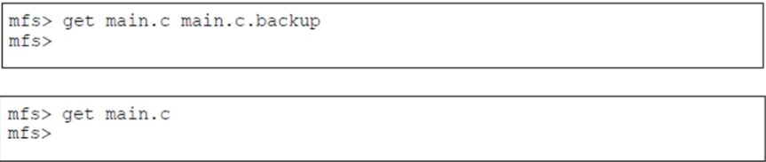
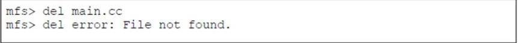

<div id="top"></div>
<!--
*** Thanks for checking out the Best-README-Template. If you have a suggestion
*** that would make this better, please fork the repo and create a pull request
*** or simply open an issue with the tag "enhancement".
*** Don't forget to give the project a star!
*** Thanks again! Now go create something AMAZING! :D
-->


<!-- PROJECT SHIELDS -->
<!--
*** I'm using markdown "reference style" links for readability.
*** Reference links are enclosed in brackets [ ] instead of parentheses ( ).
*** See the bottom of this document for the declaration of the reference variables
*** for contributors-url, forks-url, etc. This is an optional, concise syntax you may use.
*** https://www.markdownguide.org/basic-syntax/#reference-style-links
-->

<!--
[![Contributors][contributors-shield]][contributors-url]
[![Forks][forks-shield]][forks-url]
[![Stargazers][stars-shield]][stars-url]
[![Issues][issues-shield]][issues-url]
[![MIT License][license-shield]][license-url]
[![LinkedIn][linkedin-shield]][linkedin-url]
-->


<!-- PROJECT LOGO -->
<div align="center">
  <h3 align="center">FAT32 File System</h3>

  <p align="center"> A user space shell application that interprets FAT32 file system image. </p>
</div>


<!-- TABLE OF CONTENTS -->
<details>
  <summary>Table of Contents</summary>
  <ol>
    <li>
      <a href="#about-the-project">About The Project</a>
      <ul>
        <li><a href="#built-with">Built With</a></li>
      </ul>
    </li>
    <li>
      <a href="#getting-started">Getting Started</a>
      <ul>
        <li><a href="#prerequisites">Prerequisites</a></li>
        <li><a href="#installation">Installation</a></li>
      </ul>
    </li>
    <li><a href="#usage">Usage</a></li>
    <li><a href="#roadmap">Roadmap</a></li>
    <li><a href="#contributing">Contributing</a></li>
    <li><a href="#license">License</a></li>
    <li><a href="#contact">Contact</a></li>
    <li><a href="#acknowledgments">Acknowledgments</a></li>
  </ol>
</details>


<!-- ABOUT THE PROJECT -->
## About The Project

This is a user space portable file system. This program will provide the user with ~33MB of drive space in a disk image. Users will have the ability to create the filesystem image, list the files currently in the file system, add files, remove files, and save the filesystem. Files will persist in the file system when the program exits.  . 

* Opens and closes the FAT32 image file.
* Navigates through the image file and prints out following information in both base 10 and base 16:
    *  BPB_BytsPerSec
    *  BPB_SecPerClus
    *  BPB_RsvdSecCnt
    *  BPB_NumFats
    *  BPB_FATSz32
* Prints out the attributes and starting cluster number of the file or directory name.
* Retrives the file from the FAT 32 image and places it onto the current working directory.
* Implements "cd" command to change the current working directory - supports relative and absolute paths.
* Implements "ls" command to lists the directory contents.
* Reads from the given file at the position, in bytes, specified by the position parameter annd output the number of bytes specified.

For more specification refer to [FAT-32 Documentation](https://github.com/BirajSinghGCUTA/C-Heap)

<p align="right">(<a href="#top">back to top</a>)</p>

### Built With

* [C]

<p align="right">(<a href="#top">back to top</a>)</p>


<!-- GETTING STARTED -->
## Getting Started

This program has been tested in a Linux OS, I recommend using Linux(RedHat or Ubuntu) while using this program. 

### Prerequisites

To run C++ or C, first install gcc compilers 
* buid-essential
  ```sh
  sudo apt install build-essential
  ```
* install manpage 
  ```sh
  sudo apt-get install manpages-dev
  ```

### Installation

The code compiles into four shared libraries and four test programs.  To build the code, change to your top level assignment directory and type: 

The application is built in an Linux.

In terminal:
```sh
gcc mfs.c -o mfs 
mfs
```
To access just the shell, complie msh.c under SRC shell

```sh
gcc mfh.c -o mfs 
mfs
```

<!-- USAGE EXAMPLES -->
## Usage Examples

1. The command shall take the form:
```sh
get <filename> <newfilename>  
mfs
```


2. If the file does not exist in the file system an error will be printed that states: get error: File not found.


3. If the file does exist in the file system it shall be deleted and all the space available for additional files. 



4. The list command - The list command shall display all the files in the file system, their size in bytes and the time they were added to the file system 


5. If no files are in the file system a message shall be printed: list: No files found.


6. The df command - The df command shall display the amount of free space in the    file system in bytes. 


<p align="right">(<a href="#top">back to top</a>)</p>


<!-- ROADMAP -->
## Roadmap

- [x] The program will print out a prompt of mfs> when it is ready to accept input. 
- [x] Ther program will be allocating 4226 blocks for the file system. 
- [x] The file system shall support files up to 10,240,000 bytes in size.
- [X] The file system shall support up to 128 files. 
- [X] The file system block size shall be 8192 bytes.
- [X] The file system shall use an indexed allocation scheme. 
- [X] The file system shall support file names of up to 32 characters.  
- [X] Supported file names shall only be alphanumeric with “.”. There shall be no restriction to how many characters appear before or after the “.”. There shall be support for files without a “.”   
- [X] The file system will store the directory in the first (block 0) disk block.  
- [X] The file system shall allocate blocks 3-131 for inodes 
- [X] The file system shall use block 1 for the inode map 
- [X] The file system shall use block 2 for the free block map  
- [X] The directory structure shall be a single level hierarchy with no subdirectories.


<p align="right">(<a href="#top">back to top</a>)</p>


<!-- CONTRIBUTING -->
## Contributing

Contributions are what make the open source community such an amazing place to learn, inspire, and create. Any contributions you make are **greatly appreciated**.

If you have a suggestion that would make this better, please fork the repo and create a pull request. You can also simply open an issue with the tag "enhancement".
Don't forget to give the project a star! Thanks again!

1. Fork the Project
2. Create your Feature Branch (`git checkout -b feature/AmazingFeature`)
3. Commit your Changes (`git commit -m 'Add some AmazingFeature'`)
4. Push to the Branch (`git push origin feature/AmazingFeature`)
5. Open a Pull Request

<p align="right">(<a href="#top">back to top</a>)</p>


<!-- LICENSE -->
## License

Distributed under the MIT License. See `LICENSE.txt` for more information.

<p align="right">(<a href="#top">back to top</a>)</p>


<!-- CONTACT -->
## Contact

Biraj Singh GC- [@birajsinghgc@gmail.com](birajsinghgc@gmail.com)

Project Link: [https://github.com/BirajSinghGCUTA/Fat-32-File-System](https://github.com/BirajSinghGCUTA/Fat-32-File-System)

<!-- ACKNOWLEDGMENTS -->
## Acknowledgments

### PROF. Trevor J. Bakker
### Rhitu Thapa

<p align="right">(<a href="#top">back to top</a>)</p>


<p align="right">(<a href="#top">back to top</a>)</p>
